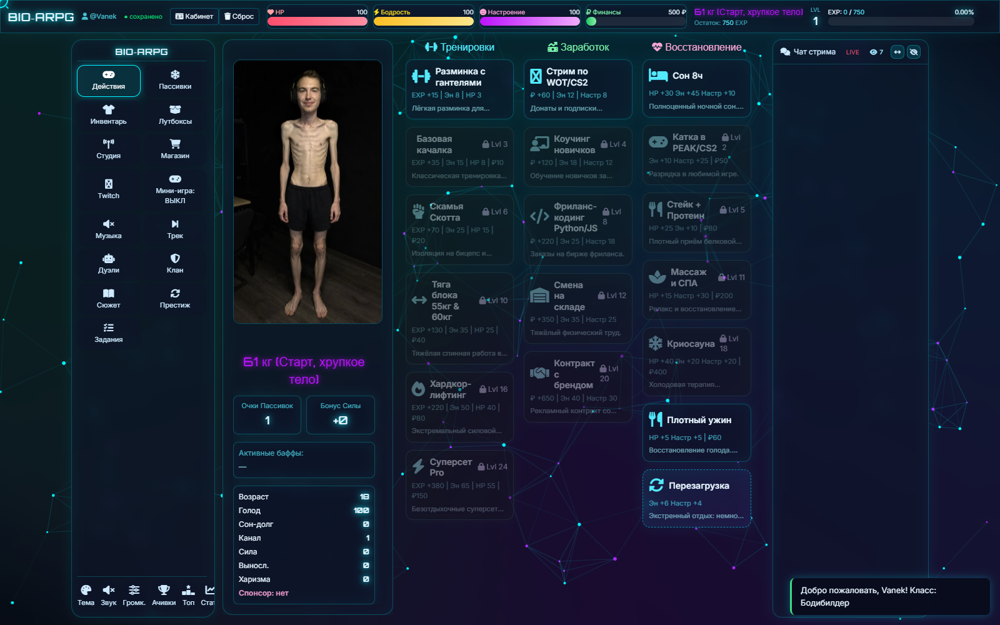
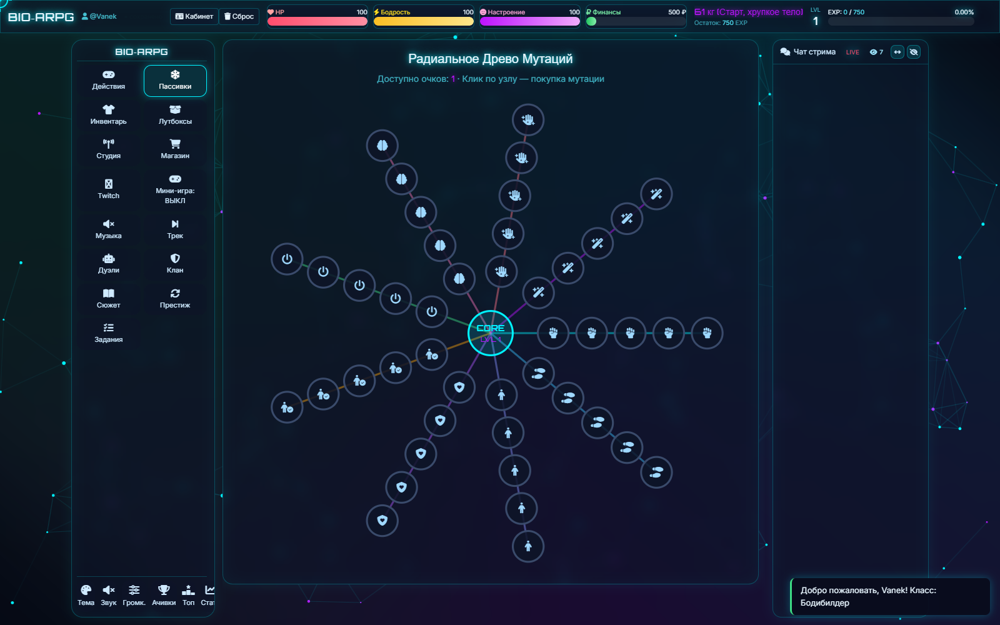
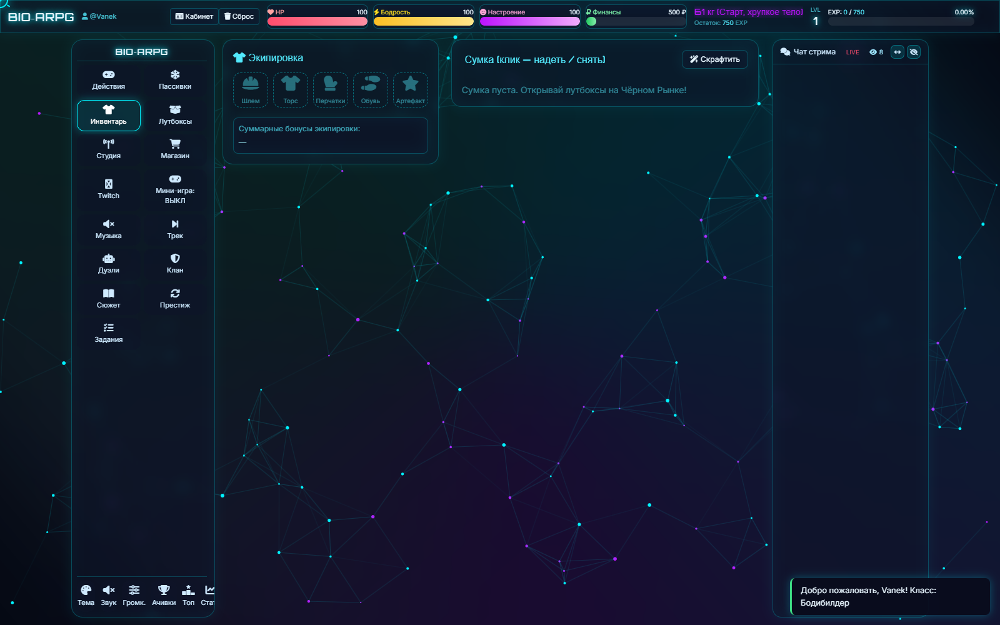

# BIO-ARPG: Симулятор Трансформации Стримера

Неоновая ARPG-игра в браузере: прокачай тело стримера от **61 до 110 кг** — тренируйся, стримь, открывай лутбоксы, покупай мутации и побеждай ботов в дуэлях.



## Возможности

- **Прогрессия форм** — 13 стадий тела (61→110 кг) с фотографиями и анимацией трансформации
- **Действия** — тренировки, заработок на стримах и восстановление с балансом ресурсов (бодрость, настроение, голод, сон-долг, аренда)
- **Радиальное древо мутаций** — 9 веток по 5 уровней с пассивными бонусами
- **Лутбоксы** — 28 предметов 4 редкостей с уникальными неоновыми артом, экипировка в 5 слотов
- **Случайные события** — 8 сюжетных развилок с выбором
- **Дуэли с ботами** — 6 противников разной силы и наградой
- **Еженедельные задания** — 3 квеста с недельным сбросом и наградами
- **Достижения, престиж, клан, сюжетные главы, статистика и спарклайны**
- **Синтвейв-саундтрек** — 4 трека, генерируются на лету через WebAudio (0 КБ ассетов), переключаются вместе с темой оформления
- **4 цветовые темы**, кастомный курсор-прицел, чат стрима с зрителями
- **Интеграция Twitch** — вход через OAuth, статус эфира, зрители чата
- Сохранение в localStorage с авто-миграцией старых сейвов, экспорт/импорт

## Экраны

| Действия | Пассивки | Инвентарь |
|---|---|---|
|  |  |  |

## Запуск

Статический сайт без сборки — достаточно любого статик-хостинга:

```bash
# локально: открыть index.html в браузере, либо
npx serve .
```

Деплой: Vercel / GitHub Pages — авто-деплой при пуше в `main`.

## Сборка Tailwind

CSS уже собран (`css/tailwind.min.css`). Для пересборки после изменения классов:

```bash
npm i tailwindcss @tailwindcss/cli
npx @tailwindcss/cli -i css/tailwind.input.css -o css/tailwind.min.css --minify
```

## Структура проекта

```
index.html          — вся разметка экранов
js/data.js          — игровые данные (формы, тренировки, предметы, события, треки…)
js/game.js          — логика, рендер, музыка (WebAudio-секвенсор)
js/events.js        — делегирование кликов ([data-call] / [data-args])
js/background.js    — интерактивный фон-канвас + кастомный курсор
css/game.css        — стили темы; css/tailwind.min.css — собранный Tailwind (не править руками)
images/             — формы (webp), images/items/ — svg предметов
```

## Управление

- Всё мышью: клики по карточкам действий, древу мутаций, инвентарю
- Кнопка **«Трек»** — сменить саундтрек, **«Тема»** — цветовую схему (трек следует за темой)
- **«Громк.»** — слайдеры музыки и эффектов
- Кнопки чата: сменить сторону / скрыть

## Технологии

Vanilla JS (ES2020), Tailwind CSS 4, Font Awesome 6, WebAudio API, Canvas API. Без фреймворков и сборщиков — только статика.

---
*Игра — сатирический симулятор, все совпадения с реальными стримерами случайны.*
